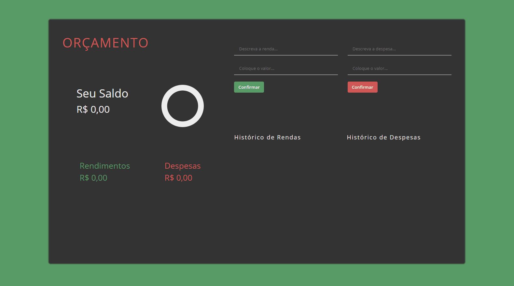

# Budget-App

Aplicação de Controle de Orçamento com TypeScript e React, o usuário pode registrar seus rendimentos e suas despesas, que serão adicionados aos respectivos históricos, automaticamente serão calculados os totais de cada um, bem como o saldo. Os históricos e todos os outros dados ficam salvos no local storage. Acesse o projeto [aqui](https://budget-app-mauve.vercel.app/).

Versão em [JS Puro e SASS](https://github.com/theandersonfonseca/Budget-App).

O layout e as funcionalidades gerais do projeto foram inspiradas em um [tutorial do youtube](https://www.youtube.com/watch?v=fDffQYs2WB0).

